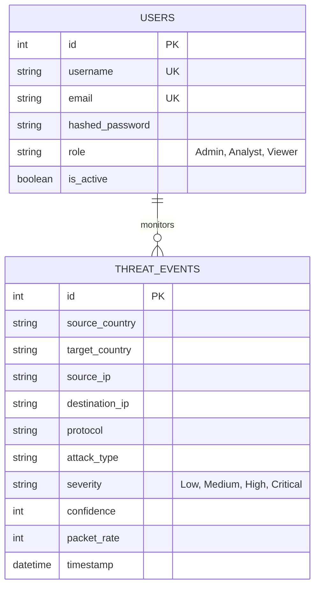

# CyberShield AI - Database ER Diagram

Below is the Entity-Relationship (ER) diagram for the PostgreSQL database utilized by CyberShield AI.

## Description
1. **USERS Table**: Stores analyst credentials. Role-based access ensures only authorized personnel can view the dashboard. Passwords are encrypted via bcrypt.
2. **THREAT_EVENTS Table**: The core table accumulating network traffic events from the simulator. This is queried heavily by the AI Analytics endpoints to generate the historical metrics and CSV reports.
